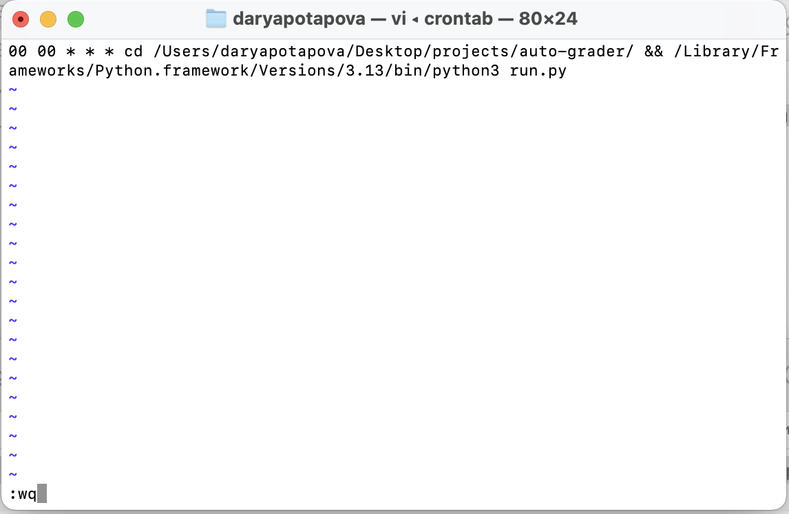
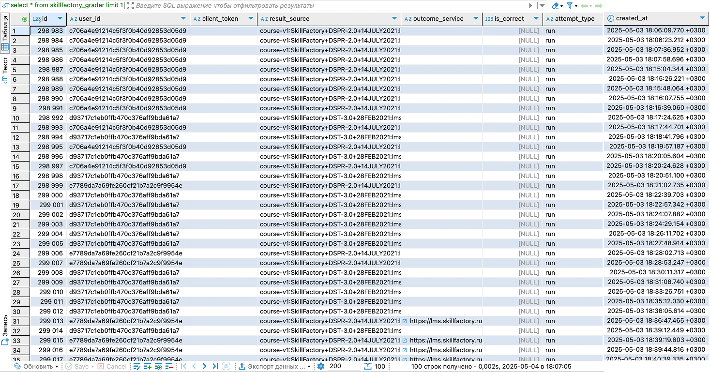
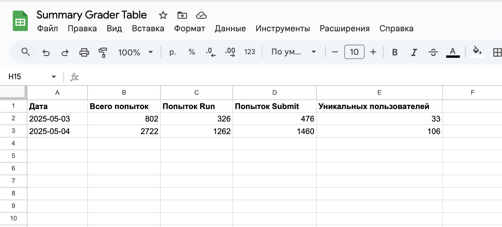
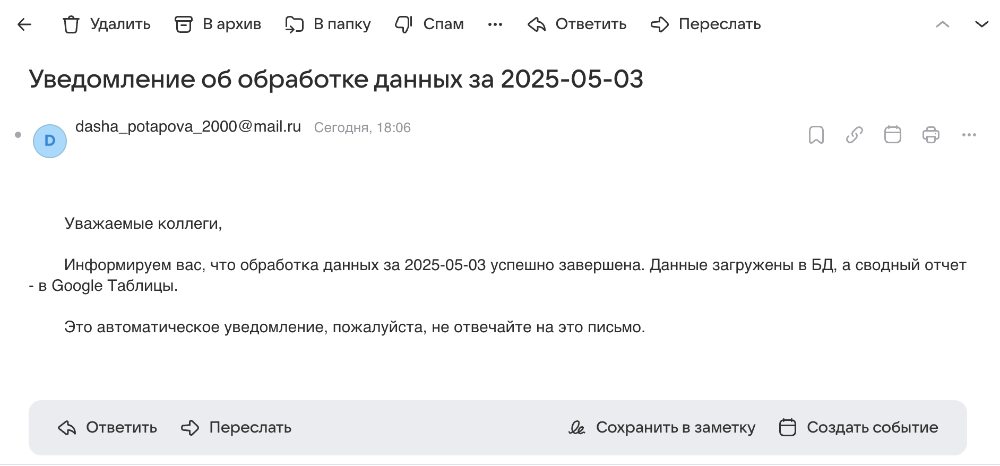

# 📊 Автоматизированный ETL-пайплайн для обработки данных с API и загрузки в базу данных

Данные представляют собой результаты пользовательских попыток прохождения задания, полученные через API (включают ID пользователя, тип попытки, корректность, дату и т.д.). Задача — автоматизировать процесс их ежедневного сбора, обработки и загрузки в базу данных для последующего анализа и мониторинга.

## Возможности
Пайплайн выполняет следующие задачи:
1. Извлечение данных за заданный период через API (по умолчанию - за предыдущие сутки);
2. Преобразование и валидация полученных данных;
3. Загрузка обработанных данных в базу данных;
4. Генерация сводных отчетов и их загрузка в Google Sheets;
5. Отправка уведомлений по электронной почте о завершении пайплайна;
6. Логирование всех шагов;
7. Автоматический запуск (cron).

## Этапы ETL
**ETL (Extract, Transform, Load)** реализован следующим образом:
1. **Extract**
- Скрипт *api_client.py* запрашивает данные по API
2. **Transform**
- *process_data.py* валидирует и структурирует данные
3. **Load**
- *database.py* создает подключение и загружает данные в PostgreSQL

Дополнительно: 
- *GSsummary.py* создаёт и загружает сводный отчет в Google Sheets
- *mail_sender.py* отправляет уведомлений на почту
- *logger.py* логирование всех этапов выполнения

## Структура проекта

```plaintext
auto-grader
├── scripts/
│   ├── api_client.py
│   ├── process_data.py
│   ├── database.py
│   ├── GSsummary.py
│   ├── mail_sender.py
│   └── logger.py
│   └── run.py
|
├── sql/
|
├── logs/
│   └── log_YYYY-MM-DD.log
|
├── results_img/
|
├── config.ini
├── requirements.txt
└── README.md
```

## Установка и запуск
#### Шаг 1: Клонирование репозитория
```bash
git clone https://github.com/Darya-Potapova2/Automated-ETL-from-API-to-Db.git
cd Automated-ETL-from-API-to-Db
```

#### Шаг 2: Установка окружения
```bash
python3 -m venv venv
source venv/bin/activate
pip install -r requirements.txt
```

#### Шаг 3: Настройка конфигурации
Создайте свой config.ini на основе шаблона. Укажите свои значения для следующих секций:

**[Database]**
- Данные для подключения к PostgreSQL
- TABLE — имя таблицы, в которую будут грузиться данные

**[API]**
- url, client, client_key — для подключения к API

**[Email]**
- SMTP-логин и пароль (для Mail.ru потребуется специальный пароль для приложения)
- recipients - список email-адресов получателей уведомления

**[Google]**
- credentials_file — путь к JSON-файлу с OAuth-ключами
- table_url — ссылка на Google-таблицу 

**[Logging]**
- logs_dir - название папки для сохранения файлов с логами
- days_to_keep - количество дней, для которых сохраняются логи

### Шаг 4. Создание таблицы в базе данных
Перед запуском необходимо создать таблицу в базе PostgreSQL. Пример SQL-запроса:
```sql
CREATE TABLE your_table (
    id SERIAL NOT NULL PRIMARY KEY,
    user_id TEXT NOT NULL,
    client_token TEXT NOT NULL,
    result_source TEXT,
    outcome_service TEXT,
    is_correct INT,
    attempt_type TEXT,
    created_at TIMESTAMPTZ(6)
)
```

### Шаг 5: Запуск скрипта
**Для ручного запуска:**
```bash
python scripts/run.py 
# или python3 scripts/run.py 
```

**Автоматизация скрипта:**

Для запуска скрипта по расписанию в проекте используется cron. Пример: обработка данных за предыдыщий день - запуск каждый день в 00:00 (обновите путь к Python и проекту)
```bash
00 00 * * * cd /Users/daryapotapova/Desktop/projects/auto-grader/ && /Library/Frameworks/Python.framework/Versions/3.13/bin/python3 scripts/run.py
```



### Результаты
После запуска:

**Данные сохраняются в PostgreSQL**




**В Google Sheets загружается сводный отчет**



**Отправляется письмо со уведомлением**



**Все этапы логируются в /logs**

[Пример файла с логами](logs/2025-05-04.txt)

